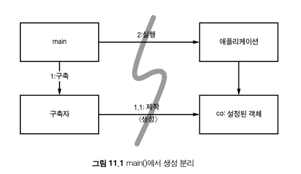
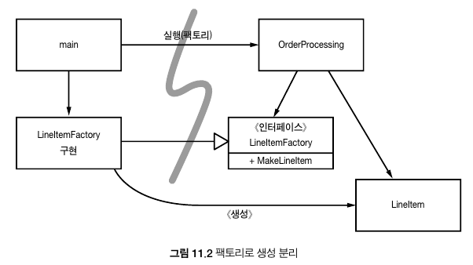

# Chapter 11. 시스템


---


## 도시를 세운다면?

도시는 수도 관리 팀, 전력 관리 팀, 교통 관리 팀 등 각 분야를 관리하는 팀이 있기에 잘 돌아간다.

또 다른 이유는 적절한 **추상화**와 **모듈화** 때문이다.

그래서 큰 그림을 이해하지 못할지라도 개인과 개인이 관리하는 '구성요소'는 효율적으로 돌아간다.

깨끗한 코드를 구현하면 낮은 추상화 수준에서 관심사를 분리하기 쉬워진다.

이 장에서는 추상화 수준, 즉 **시스템 수준에서도 깨끗함을 유지하는 방법**을 살펴본다.

</br>

## 시스템 제작과 시스템 사용을 분리하라

>소프트웨어 시스템은 (애플리케이션 객체를 제작하고 의존성을 서로 '연결'하는)
>준비 과정과 (준비 과정 이후에 이어지는) 런타임 로직을 분리해야 한다.

제작(Construction)과 사용(use)는 아주 다르다.

한 예로 공사장을 떠올려보자. 많은 인부가 작업에 투입되고 콘크리트에 기중기와 승강기를 부착해두었다.

건물이 완공되고 나면 기중기와 승강기는 사라지고 유리벽과 예쁜 색상의 벽으로 말끔히 꾸며진 채로 남게 된다.


대다수 어플리케이션은 시작 단계라는 관심사를 분리하지 않는다.

```java
// 초기화 지연, 계산 지연이라는 기법
public Service getService() {
    if (service == null)
        service = new MyServiceImpl(...); // 모든 상황에 적합한 기본값일까?
    return service;
}
```

장점은 아래와 같다.

- 실제로 필요할 때까지 객체를 생성하지 않으므로 불필요한 부하가 걸리지 않는다. 애플리케이션을 시작하는 시간이 그만큼 빨라진다
- 어떤 경우에도 Null을 반환하지 않는다.

문제점은 아래와 같다.

- **의존성**
  - getService 메서드가 MyServiceImpl과 생성자 인수에 명시적으로 의존한다.
  - 런타임 로직에서 MyServiceImpl 객체를 전혀 사용하지 않더라도 의존성을 해결하지 않으면 컴파일이 안 된다.
- **테스트**
  - My ServiceImpl이 무거운 객체라면 단위 테스트에서 getService 메서드를 호출하기 전에 적절한 테스트 전용 객체(TEST DOUBLE이나 MOCK OBJECT)를 service 필드에 할당해야 한다.
  - 일반 런타임 로직에다 객체 생성 로직을 섞어놓은 탓에 (service가 null인 경로와 null이 아닌 경로 등) **모든 실행 경로도 테스트해야 한다.**
  - 책임이 둘이라는 말은 메서드가 작업을 두 가지 이상 수행한다는 의미다. 즉, 단일 책임 원칙(SRP)를 깬다.

현실적으로 <u>한 객체 유형이 모든 문맥에 적합할 가능성</u>이 있을까?

설정 논리는 일반 실행 논리와 분리해야 모듈성이 높아진다.

또한 주요 의존성을 해소하기 위한 방식, 즉 전박적이며 일관적인 방식도 필요하다.

</br>

### Main 분리

- 생성과 관련한 코드는 모두 main이나 main이 호출하는 모듈로 옮기고, 나머지 시스템은 모든 객체가 생성되었고 모든 의존성이 연결되었다고 가정한다.



- 제어 흐름
  - main 함수에서 시스템에 필요한 객체를 생성한 후 이를 애플리케이션에 넘긴다.
  - 애플리케이션은 그저 객체를 사용할 뿐이다.
  - 애플리케이션은 main이나 객체가 생성되는 과정을 전혀 모른다.

</br>

### 팩토리

- 때로는 객체가 생성되는 시점을 애플리케이션이 결정할 필요도 생긴다.

- 예를들어, 주문처리 시스템에서 애플리케이션은 LineItem 인스턴스를 생성해 Order에 추가한다.

  - 이때는 ABSTRACT FACTORY 패턴을 사용한다.
  - 그러면 LineItem을 생성하는 시점은 애플리케이션이 결정하지만 LineItem을 생성하는 코드는 애플리케이션이 모른다.

  

  - 그 방법은 main 쪽에 있는 LineItemFactoryImplementation이 안다.

</br>

### 의존성 주입

- 제어 역전(IoC) 기법을 의존성 관리에 적용한 메커니즘이다.
- 새로운 객체는 넘겨밭은 책임만 맡으므로 단일 책임 원칙(SRP)를 지키게 된다.
- 초기 설정은 시스템 전체에서 필요하므로 대개 '책임질' 메커니즘으로 'main' 루틴이나 특수 컨테이너를 사용한다.

```java
// 의존성 주입을 '부분적으로' 구현한 JNDI 검색 기능
MyService myService = (MyService)(jndiContext.lookup("NameOfMyService"));
```

- 객체는 디렉터리 서버에 이름을 제공하고 그 이름에 일치하는 서비스를 요청한다.
- 호출하는 객체는 의존성을 능동적으로 해결한다.

**진정한 의존성 주입은 여기서 한 걸음 더 나아간다.**

- 클래스가 의존성을 해결하려 시도하지 않는다. 클래스는 완전히 수동적이다.
- 대신에 의존성을 주입하는 방법으로 setter 메서드나 생성자 인수를 (혹은 둘 다를) 제공한다.
- DI 컨테이너는 (대개 요청이 들어올 때마다) 필요한 객체의 인스턴스를 만든 후 생성자 인수나 setter 메서드를 사용해 의존성을 설정한다.
- 실제로 생성되는 객체 유형은 설정 파일에서 지정하거나 특수 생성 모듈에서 코드로 명시한다.

스프링 프레임워크는 가장 널리 알려진 자바 DI 컨테이너를 제공한다.

- 객체 사이 의존성은 XML 파일에 정의한다.
- 자바 코드에서는 이름으로 특정한 객체를 요청한다.

</br>

**그러나 초기화 지연으로 얻는 장점은 포기해야 하는걸까?**

- 대다수 DI 컨테이너는 필요할 때까지는 객체를 생성하지 않고, 대부분은 계산 지연이나 비슷한 쵲거화에 슬 수 있또록 팩토리를 호출하거나 프록시를 생성하는 방법을 제공한다.
- 즉, 계산 지연 기법이나 이와 유사한 최적화 기법에서 이런 메커니즘을 사용할 수 있다.

</br>

## 확장

> 소프트웨어 시스템은 물리적인 시스템과 다르다. 관심사를 적절히 분리해 관리한다면 소프트웨어 아키텍처는 점진적으로 발전할 수 있다.

소프트웨어 시스템은 '수명이 짧다'는 본질로 인해 아키텍처의 점진적인 발전이 가능하다.


먼저, 관심사를 적절히 분리하지 못하는 아키텍처 예를 보자.


원래 EJB1과 EJB2 아키텍처는 관심사를 적절히 분리하지 못했기에 유기적인 성장이 어려웠다. 불필요한 장벽이 생긴 탓이다. 영속적으로 저장될 Bank 클래스에 필요한 엔티티 빈을 살펴보자. 엔티티 빈은 관계형 자료, 즉 테이블 행을 표현하는 개체로, 메모리에 상주한다.


먼저, 클라이언트가 사용할 (프로세스 내) 지역 인터페이스나 (다른 JVM에 있는) 원격 인터페이스를 정의해야 한다.


```java
// 목록 11-1 Bank EJB용 EJB2 지역 인터페이스
package com.example.banking;
import java.util.Collections;
import javax.ejb.*;

public interface BankLocal extends java.ejb.EJBLocalObject {
    String getStreetAddr1() throws EJBException;
    String getStreetAddr2() throws EJBException;
    String getCity() throws EJBException;
    String getState() throws EJBException;
    String getZipCode() throws EJBException;
    void setStreetAddr1(String street1) throws EJBException;
    void setStreetAddr2(String street2) throws EJBException;
    void setCity(String city) throws EJBException;
    void setState(String state) throws EJBException;
    void setZipCode(String zip) throws EJBException;
    Collection getAccounts() throws EJBException;
    void setAccounts(Collection accounts) throws EJBException;
    void addAccount(AccountDTO accountDTO) throws EJBException;
}
```

- 열거하는 속성은 Bank 주소, 은행이 소유하는 계좌다.
- 각 계좌 정보는 Account EJB로 처리한다.

아래는 위의 인터페이스를 구현한 Bank 빈에 대한 구현 클래스다.

```java
// 목록 11-2 상응하는 EJB2 엔티티 빈 구현
package com.example.banking;
import java.util.Collections;
import javax.ejb.*;

public abstract class Bank implements javax.ejb.EntityBean {
    // 비즈니스 로직...
    public abstract String getStreetAddr1();
    public abstract String getStreetAddr2();
    public abstract String getCity();
    public abstract String getState();
    public abstract String getZipCode();
    public abstract void setStreetAddr1(String street1);
    public abstract void setStreetAddr2(String street2);
    public abstract void setCity(String city);
    public abstract void setState(String state);
    public abstract void setZipCode(String zip);
    public abstract Collection getAccounts();
    public abstract void setAccounts(Collection accounts);

    public void addAccount(AccountDTO accountDTO) {
        InitialContext context = new InitialContext();
        AccountHomeLocal accountHome = context.lookup("AccountHomeLocal");
        AccountLocal account = accountHome.create(accountDTO);
        Collection accounts = getAccounts();
        accounts.add(account);
    }

    // EJB 컨테이너 로직
    public abstract void setId(Integer id);
    public abstract Integer getId();
    public Integer ejbCreate(Integer id) { ... }
    public void ejbPostCreate(Integer id) { ... }

    // 나머지도 구현해야 하지만 일반적으로 비어있다.
    public void setEntityContext(EntityContext ctx) {}
    public void unsetEntityContext() {}
    public void ejbActivate() {}
    public void ejbPassivate() {}
    public void ejbLoad() {}
    public void ejbStore() {}
    public void ejbRemove() {}
}
```

- 객체를 생성하는 팩토리인 LocalHome 인터페이스는 생략했다.
- 기타 Bank 탐색(질의) 메서드도 생략했다.

**문제점**

- 비즈니스 로직은 EJB2 애플리케이션 '컨테이너'에 강하게 결합된다. 클래스를 생성할 때는 컨테이너에서 파생해야 하며 컨테이너가 요구하는 다양한 생명주기 메서드도 제공해야 한다.
- 이렇듯 비즈니스 논리가 덩치 큰 컨테이너와 밀접하게 결합된 탓에 독자적인 단위 테스트가 어렵다. 컨테이너를 흉내 내거나(어려움) 아니면 많은 시간을 낭비하며 EJB와 테스트를 실제 서버에 배치해야 한다. 그래서 EJB2 코드는 프레임워크 밖에서 재사용하기란 사실상 불가능하다.
- 결국 객체 지향 프로그래밍이라는 개념조차 뿌리가 흔들린다. 빈은 다른 빈을 상속 받지 못한다.

</br>

### 횡단(cross-cutting) 관심사

- EJB 아키텍처는 일부 영역에서 관심사를 거의 완벽하게 분리한다.
  - 예) 원하는 트랜잭션, 보안, 일부 영속적인 동작은 소스 코드가 아니라 배치 기술자에서 정의한다.
- 영속성과 같은 관심사는 모든 객체가 전반적으로 동일한 방식을 이용하게 만들어야 한다.
  - 예) 특정 DBMS나 독자적인 파일을 사용하고, 테이블과 열은 같은 명명 관례를 따르며, 트랜잭션 의미가 일관적이면 더욱 바람직하다.

- 사실 EJB 아키텍처가 영속성, 보안, 트랜잭션을 처리하는 방식은 관점 지향 프로그래밍(AOP)을 예견했다고 보인다.

</br>

자바에서 사용하는 관점 혹은 관점과 유사한 메커니즘 세 개를 살펴보자.

</br>

## 자바 프록시

자바 프록시는 단순한 상황에 적합하다.

개별 객체나 클래스에서 메서드 호출을 감싸는 경우가 좋은 예다.

```java
// 목록 11-3 JDK 프록시 예제
// Bank.java (패키지 이름을 감춘다)
import java.utils.*;

// 은행 추상화
public interface Bank {
    Collection<Account> getAccounts();
    void setAccounts(Collection<Account> accounts);
}

// BankImpl.java
import java.utils.*;

// 추상화를 위한 POJO("Plain Old Java Object") 구현
public class BankImpl implements Bank {
    private List<Account> accounts;

    public Collection<Account> getAccounts() {
        return accounts;
    }

    public void setAccounts(Collection<Account> accounts) {
        this.accounts = new ArrayList<Account>();
        for (Account account: accounts) {
            this.accounts.add(account);
        }
    }
}
// BankProxyHandler.java
import java.lang.reflect.*;
import java.util.*;

// 프록시 API가 필요한 "InvocationHandler"
public class BankProxyHandler implements InvocationHandler {
    private Bank bank;

    public BankHandler (Bank bank) {
        this.bank = bank;
    }

    // InvocationHandler에 정의된 메서드
    public Object invoke(Object proxy, Method method, Object[] args) throws Throwable {
        String methodName = method.getName();
        if (methodName.equals("getAccounts")) {
            bank.setAccounts(getAccountsFromDatabase());
            return bank.getAccounts();
        } else if (methodName.equals("setAccounts")) {
            bank.setAccounts((Collection<Account>) args[0]);
            setAccountsToDatabase(bank.getAccounts());
            return null;
        } else {
            ...
        }
    }

    // 세부사항은 여기에 이어진다.
    protected Collection<Account> getAccountsFromDatabase() { ... }
    protected void setAccountsToDatabase(Collection<Account> accounts) { ... }
}

// 다른 곳에 위치하는 코드
Bank bank = (Bank) Proxy.newProxyInstance(
    Bank.class.getClassLoader(),
    new Class[] { Bank.class },
    new BankProxyHandler(new BankImpl())
);
```

- 프록시로 감쌀 인터페이스 Bank와 비즈니스 논리를 구현하는 POJO BankImpl을 정의했다.

