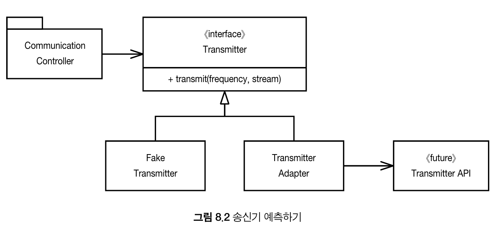

# Chapter 8. 경계
- [Chapter 8. 경계](#chapter-8-경계)
  - [* 깨끗한 경계](#-깨끗한-경계)
  - [외부 코드 사용하기](#외부-코드-사용하기)
  - [경계 살피고 익히기](#경계-살피고-익히기)
  - [학습 테스트는 공짜 이상이다](#학습-테스트는-공짜-이상이다)
  - [아직 존재하지 않는 코드를 사용하기](#아직-존재하지-않는-코드를-사용하기)
  - [깨끗한 경계](#깨끗한-경계)
---
우린 때로 외부 코드를 우리 코드에 깔끔하게 통합해야만 한다.

이 장에서는 소프트웨어 경계를 깔끔하게 처리하는 기법과 기교를 살펴본다.

## 외부 코드 사용하기

`java.util.Map`을 살펴보자.

Map이 제공하는 기능성과 유연성은 확실히 유용하지만 그만큼 위험도 크다.

넘기는 쪽에서는 Map 내용을 삭제하지 않으리라 믿을 수 있다.

하지만 해당 Map을 사용하는 개발자라면 `clear()`를 자유롭게 사용할 수 있다.

따라서 Map을 공개 API의 인수로 넘기거나 반환값으로 사용하지 않도록 해야한다.

## 경계 살피고 익히기

외부 코드를 익히거나 통합하기란 어렵다.

조금 다르게 접근해보자.

우리쪽 코드를 작성해 외부 코드를 호출하는 대신 먼저 **간단한 테스트 케이스를 작성해 외부 코드를 익히는 방법**은 어떨까?

이를 `학습 테스트`라고 한다.

`학습 테스트`는 API를 사용하려는 목적에 초점을 맞추고 우리 프로그램에서 사용하려는 방식대로 API를 호출하여 이해하는 방식이다.

## 학습 테스트는 공짜 이상이다

학습 테스트는 이해도를 높여주는 정확한 실험이다.

그리고 투자하는 노력보다 얻는 성과가 더 크다.

- 패키지 새 버전이 나온다면 학습 테스트를 돌려 차이가 있는지 확인한다.

- 일단 통합한 이후라고 하더라도 패키지가 우리 코드와 호환되리라는 보장은 없다.

- 패키지 작성자에게 코드를 변경할 필요가 생길지도 모른다.

- 패키지 작성자는 버그를 수정하고 기능도 추가한다.

- 패키지 새 버전이 나올 때마다 새로운 위험이 생긴다.

- 새 버전이 우리 코드와 호환되지 않으면 학습 테스트가 이 사실을 곧바로 밝혀낸다.

학습 테스트를 이용한 학습이 필요하든 그렇지 않든, 실제 코드와 동일한 방식으로 인터페이스를 사용하는 테스트 케이스가 필요하다.

이런 **경계 테스트가 있다면 패키지의 새 버전으로 이전하기 쉬워진다.**

그렇지 않다면 낡은 버전을 필요 이상으로 오랫동안 사용하려는 유혹에 빠지기 쉽다.

## 아직 존재하지 않는 코드를 사용하기

```text
지정한 주파수를 이용해 이 스트림에서 들어오는 자료를 아날로그 신호로 전송하라.
```

협업하는 팀에서 아직 API를 설계하지 않아서 구체적인 구현 방법을 모른다고 가정하자. 그래서 우리 팀은 구현을 나중으로 미루게 된다.

이쪽 코드를 진행하고자 자체적으로 인터페이스를 정의했다. `Transmitter`라는 간단한 클래스를 만들고 `transmit`라는 메서드를 추가했다.



즉, 우리 팀이 바라는 인터페이스를 만들었다.

협업하는 팀에서 API를 정의한 후에는 `TransmitterAdapter`를 구현해 간극을 메웠다.

`ADAPTER` 패턴으로 API 사용을 캡슐화해 API가 바뀔 때 수정할 코드를 한곳으로 모았다.

이와 같은 설계는 테스트도 아주 편하다. 적절한 `FakeTransmitter` 클래스를 사용하면 `CommunicationsController` 클래스를 테스트할 수 있다.

Transmitter API 인터페이스가 나온 다음 경계 테스트 케이스를 생성해 우리가 API를 올바로 사용하는지 테스트할 수도 있다.

## 깨끗한 경계

- 경계에 위치하는 코드는 깔끔히 분리한다
- 기대치(목표)를 정의하는 테스트 케이스도 작성한다
- 통제가 불가능한 경우 자칫하면 외부 코드에 휘둘릴 수 잇으므로 통제가 가능한 우리 코드에 의존하자
- 외부 패키지를 호출하는 코드를 가능한 줄여 경계를 관리하자
- Map에서 봤듯이 새로운 클래스로 경계를 감싸거나 아니면 ADAPTER 패턴을 사용해 우리가 원하는 인터페이스를 패키지가 제공하는 인터페이스로 변환하자

